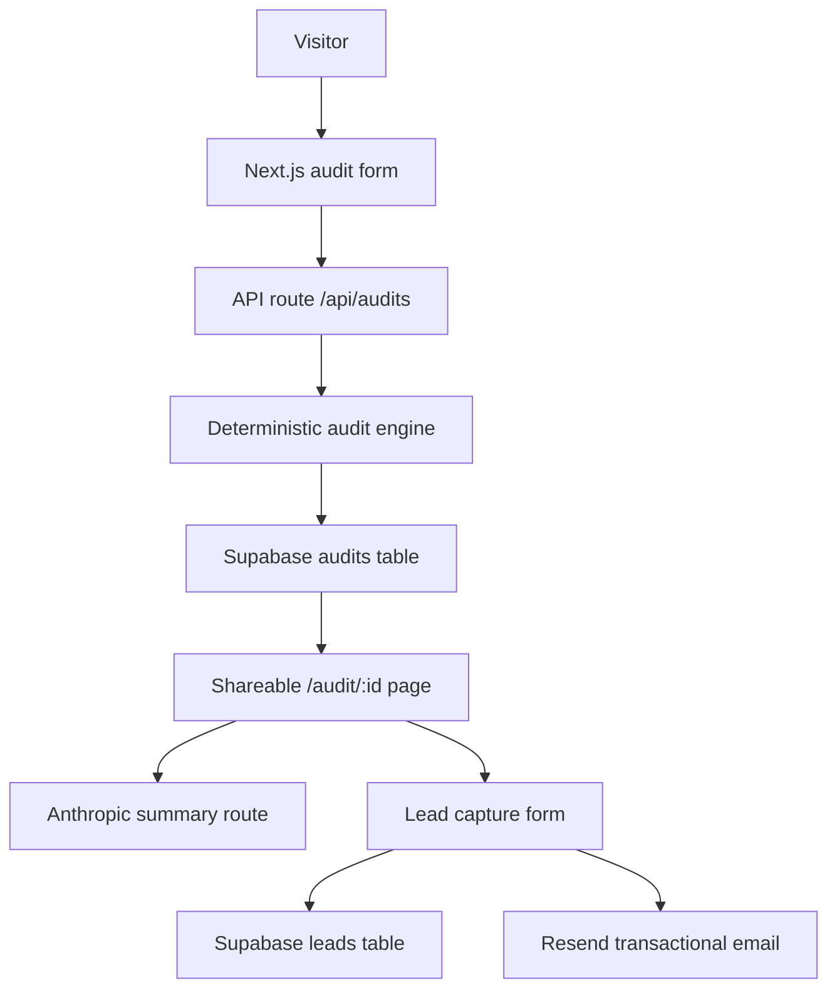

# Architecture

## Data Flow

The user enters tools, plan, spend, seats, team size, and use case. The API validates the payload with Zod, runs the audit engine, stores a sanitized report in Supabase, and returns the report ID. The report page can then request an Anthropic-generated paragraph; if the API fails, the page keeps the deterministic fallback summary.

## Stack Choice

Next.js keeps the form, public report pages, Open Graph metadata, and API routes in one deployable Vercel app. TypeScript and Zod make the audit inputs explicit. Tailwind and shadcn-style primitives keep the UI fast to iterate while still accessible. Supabase is enough for audit and lead storage, Resend handles transactional email, and Vitest covers the financial logic.

## 10k Audits Per Day

Move rate limiting to Redis or Upstash, add database indexes on `created_at` and savings, queue Resend email delivery, cache public audit pages, and move Anthropic summary generation to a background job. I would also version pricing data and audit rules so old reports remain explainable after pricing changes.
